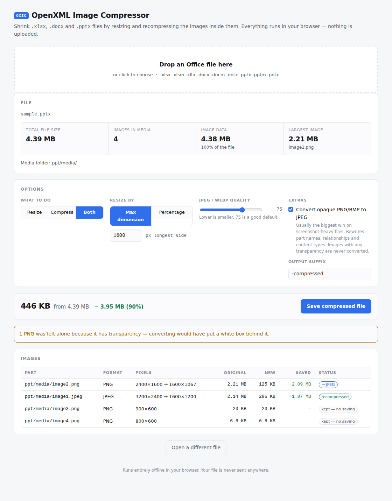

# OXIC — OpenXML Image Compressor

A single-page web app that opens an Office file (`.xlsx`, `.docx`, `.pptx`), shows how much of
its bulk is embedded images, and writes back a smaller copy.

Office files are ZIP containers, and the bloat is almost always in one `media/` folder holding
images at camera or screenshot resolution even though they render at a fraction of that size.
OXIC resizes and recompresses those images and repacks the package, leaving everything else
byte-for-byte alone.

**Open `index.html` in a browser.** There is no build step, no server, no install and no
dependencies — and your file never leaves the machine.



## What it does

1. **Reads any OpenXML file** — `.xlsx .xlsm .xltx`, `.docx .docm .dotx`, `.pptx .pptm .potx`.
2. **Reports** the total file size, the media folder it found, how many images are in it, how
   much space they take and what share of the file that is, plus a per-image breakdown.
3. **Offers resize, compress, or both**, and shows the resulting size. The figure is not a
   guess: every image is really re-encoded with your current settings, so what you see is what
   you get.
4. **Saves** the rebuilt file as `<name>-compressed.<ext>` (the suffix is editable).

### Options

| Option | Notes |
|---|---|
| **Resize / Compress / Both** | Resizing still re-encodes, so it does so at near-original quality. |
| **Max dimension** | Downscales only images whose longest side exceeds the limit. Smaller images are untouched. |
| **Percentage** | Scales every image by a fixed percentage. |
| **Quality** | JPEG and WebP encoding quality. 75 is a sensible default. |
| **Convert opaque PNG/BMP to JPEG** | Off by default. Usually the biggest single win. |
| **Output suffix** | Defaults to `-compressed`. |

## Two rules it never breaks

**It never makes anything bigger.** If a re-encoded image would take at least as much space as
the original, the original bytes are kept and the row is marked *kept — no saving*. This matters
because canvas PNG encoding frequently inflates files, and JPEG loses to PNG on flat-colour
screenshots.

**It never converts an image with transparency.** Turning a transparent PNG into a JPEG would
put a white box behind it. PNGs are checked via their header colour type and `tRNS` chunk, and
where that is inconclusive, by a full alpha-channel scan.

## PNG → JPEG conversion

Renaming an image part means every reference to it has to move too, or Office rejects the file.
When the option is on, OXIC:

- renames the part to `.jpeg` (picking a free name if one is taken);
- rewrites the `Target` of every affected relationship in each `_rels/*.rels`, resolving
  relative paths so `../media/image2.png` becomes `../media/image2.jpeg`;
- adds `<Default Extension="jpeg" ContentType="image/jpeg"/>` to `[Content_Types].xml` and
  follows any `Override` that named the renamed part.

Document XML references images by relationship ID rather than filename, so relationships and
content types are the complete set of places that need touching.

## What it leaves alone

- **Audio and video** in `ppt/media/` — listed, never modified.
- **EMF, WMF, SVG, TIFF and ICO** — the browser can't re-encode them, so they pass through.
- **GIF** — passed through, because re-encoding would flatten any animation.
- Every part outside `media/`.

## Requirements

A browser with `CompressionStream('deflate-raw')` and `OffscreenCanvas`: Chrome 103+,
Firefox 113+, Safari 16.4+. ZIP64 archives (over 4 GB) are not supported.

## Tests

Verification is structural and end-to-end — there is no Office install in the loop.

```sh
# Build the fixtures: three OpenXML files carrying the same four images.
node test/make-fixtures.mjs

# Drive index.html in a real Chromium and validate everything it produces.
node test/e2e.mjs

# Validate any OpenXML package on its own.
python3 test/validate_ooxml.py test/fixtures/sample.pptx
```

Both Node scripts need Playwright. If it is installed globally rather than in the project,
prefix them with `NODE_PATH=/opt/node22/lib/node_modules`.

`validate_ooxml.py` (stdlib only) checks that the ZIP opens and passes CRC, that every XML part
parses, that every non-external relationship `Target` resolves to a part that exists, that every
part has a declared content type, and that image bytes match their extension. Running it against
the fixtures as well as the outputs keeps it honest — a validator that only ever sees good input
proves nothing.

`e2e.mjs` covers all three formats: the reported counts and sizes against the parts on disk,
both resize modes, each of the three actions, the PNG→JPEG rename propagating into the
relationships and content types, transparent and unbeatable PNGs being left alone, a file with
no images, a file that is not a ZIP, and re-processing an output without corrupting or growing
it.
